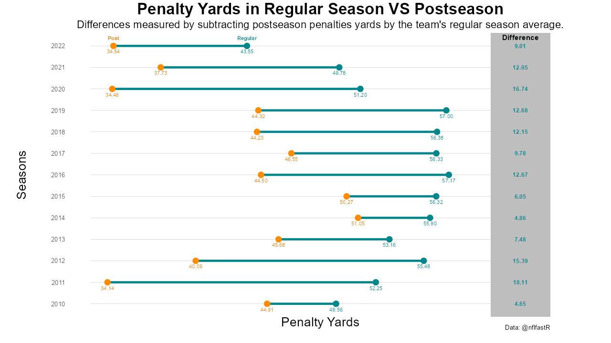

# Playoff Team Penalties
 
## Introduction
 
Watching the NFL postseason can feel like a different set of refs are officiating the game. The average number of penalties a team commits per game in the regular season is 6.33 penalties and the average penalty yards allowed is 53.87 yards. Meanwhile, the average number of penalties a team commits per game per team in the postseason is 5.09 penalties and the average penalty yards allowed is 42.22 yards. While the difference between the two is often pinned on refs deciding to swallow the whistle when the stakes are higher (Ignore the [Bradberry hold in Super Bowl LVII](https://www.youtube.com/watch?v=dNCBXFpADlo)), is that really the whole story? An alternative hypothesis was presented by former NFL offensive lineman Geoff Schwartz, where [there’s less flags in the postseason because better players are playing than in the regular season]( https://twitter.com/geoffschwartz/status/1488202911083638785). Despite it being a tweet from over a year ago (procrastination isn’t a crime), this idea stuck with me. Is the perceived difference in officiating between the regular season and postseason due to quality of play? Is that why I see the Raiders commit so many more penalties when I watch them on Sundays? This project aims to answer these questions.
 
## Methodology
 
All data used in this project is from [nflfastR](https://www.nflfastr.com/) and is from the 2010 through 2022 seasons. Both penalties and penalty yards allowed are explored as it might be the case referees will be willing to call penalties, but not the ones that carry larger loss of yard punishments. To determine if postseason penalties and penalty yardage allowed are related to the teams playing, I compare the postseason team’s penalties and penalty yardage allowed to their regular season averages. This method accounts for teams that play more postseason games and have them compared directly to their own averages. If there is no difference in officiating there should be no difference. Z-tests are used to compare the population means of regular season penalties vs postseason penalties and regular season penalty yards allowed vs postseason yards allowed as there is a sufficiently large sample size. The null hypotheses are that there are no differences between the regular season and postseason penalties and penalty yards allowed for playoff teams.

To explore if time of the season (both week and season type) have significant impacts on the number of penalties and penalty yards allowed by playoff teams, I use a linear regression. The purpose of this is to see if there could be other factors that change penalties being called beyond regular vs postseason. The threshold cutoffs for all p-values will be 0.05. All code for the statistical tests above and the visualizations found in [the plots folder](./plots/) can be found in the [penalties.R](./penalties.R) document.

## Findings

There are still notable differences between regular and postseason averages even after filtering the regular season data for playoff teams. The average postseason averages for penalties and penalty yards allowed per team per game remain at 5.09 and 42.22 respectively. The regular season averages reduce, but not by a lot: penalties average 6.17 and penalty yards allowed average 53.18 per team per game. The p-values comparing both penalties and penalty yards allowed are <.01, and we can reject both null hypotheses: there are no differences between the regular season and postseason penalties and penalty yards allowed for playoff teams. Looking at plots below we can see that since 2010 (does this trend go further back? Who knows, I never checked.), the average postseason team’s penalties and penalty yards allowed is less than the average playoff team’s regular season averages.

Moving onto the linear regressions, the coefficient estimations and average values over the course of the season for playoff team penalties over the course of the season are below:

| Coefficients | Estimates | P-values|
| — | — | — |
| Intercept | 6.72 | < 0.001 |
| Week | -0.056 | < 0.001 |
| Postseason | -0.52 | 0.0063|

The p-values for both week and postseason are < 0.01 and we can conclude that both features have a relationship to penalties committed by playoff teams.

Using the #eyetest on the time series above we can see a few drops from weeks 2 to 3, 15 to 16, and from the regular season line to postseason line. The regular season line decrease from weeks 16 to 17, and postseason changes from weeks 20 to 21 as well as 21 to 22 can be due to the limited sample sizes for weeks regular season 17, postseason 21, and postseason 22.

The results for playoff team penalty yards allowed over the course of the season are below:

| Coefficients | Estimates | P-values|
| — | — | — |
| Intercept | 58.51 | < 0.001 |
| Week | -0.57 | < 0.001 |
| Postseason | -5.02 | 0.0074|

The p-values for both week and postseason are < 0.01 and we can conclude that both features have a relationship to penalty yards allowed by playoff teams.

The trends for penalty yards allowed match what is seen for penalties committed by playoff teams.

## Considerations and Limitations

As mentioned in the findings section, some odd trends were seen week-to-week that could at least partially be attributed to small sample sizes. While some of this can’t be helped (only one super bowl is played a season), part of the limitation is due to the [NFL adding a 17th regular season game in 2021](https://nflcommunications.com/Pages/NFL-Season-To-Feature-17-Regular-Season-Games-Per-Team.aspx). This means that two of the 12 seasons in the data have 18 regular season weeks and a 22 week season, while the other 10 seasons have 17 regular season weeks and a 21 week season. One option is to reduce the week values of 2021 and 2022 seasons when week 18 or larger. This would make the last week of all the regular seasons on the same week number and have the postseason week numbers mean the same round for all seasons. Ultimately, I decided not to make this change as those were the weeks the games were played.

A limitation to the linear regressions presented above is the [collinearity](https://en.wikipedia.org/wiki/Collinearity) of the week and season type features. Collinearity is when there is a linear relationship between two variables. For a linear regression, when collinearity exists between two independent variables an increase of the standard error occurs causing an increase in p-values. It also means that there is a great deal of uncertainty in the coefficient estimates. To read more on collinearity and linear regressions see pages 99-103 of [An Introduction to Statistical Learning](https://www.statlearning.com). So what does it mean for the linear regressions in this project? Shockingly, there is a strong linear relationship between week and season type (correlation coefficient of 0.53) so there is collinearity making the size of the coefficients in both linear regressions unreliable. However, the reported significance of week and season type on penalties and penalty yards allowed by playoff teams are still valid, and I would argue the direction of the coefficients are valid as well.

## What This Means

The results show that penalties and penalty yards decrease for playoff teams as the season progresses and when in playoff games. Penalties do not decrease from regular season to postseason due to quality of play. Future work could delve further into why it occurs. Some possibilities for this consistent trend over the last 12 years could be:

* Referees deemphasizing penalties [the league highlights as points of emphasis](https://operations.nfl.com/the-rules/rules-changes/2022-rules-changes-and-points-of-clarification/) before the season.
* Players adjust their play to the points of emphasis after the first couple of weeks.
* Players get better as the season goes on (Geoff is right but with more steps!).
* Referees let more things go the more important the regular season game is.
* Referees let more things go in games that do not matter for playoffs because they want to go home.
* Referees let more things go in colder games because they want to go home.

As for what can be done with this information, teams should encourage their players to test referee penalty boundaries more the later in the season it is. For every Bradberry hold there’s a [Tee Higgins face masking Jalen Ramsey for a 75-yard touchdown](https://www.youtube.com/watch?v=htBMBZiJwv4) or [Nickell Robey-Coleman committing a pass interference so blatant that after it was missed the league pretended to make the penalty reviewable for a season.](https://www.youtube.com/watch?v=YjOk5jYTgp0)
